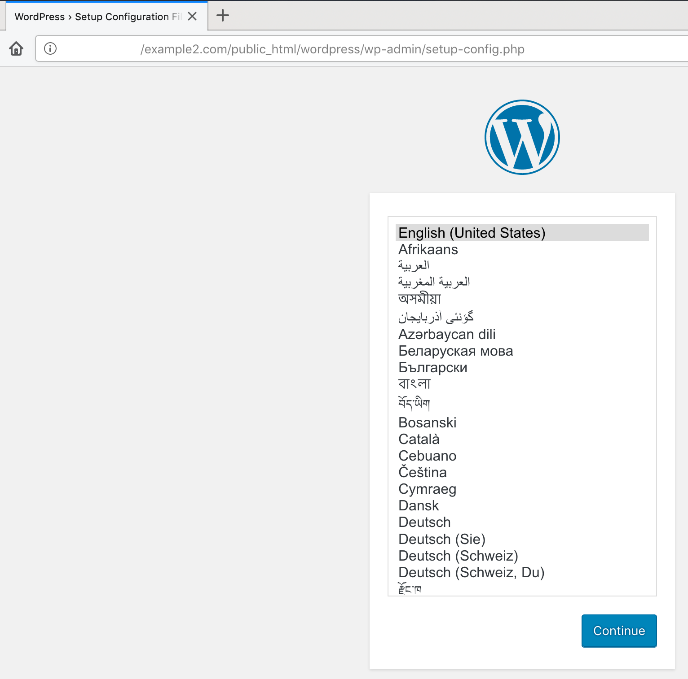

---
author:
  name: Jonathan Tsai
  email: docs@linode.com
description: 'This guide shows how to configure Apache Virtual Hosts to serve multiple WordPress sites from the same Linode.'
keywords: ["install WordPress", "WordPress on Linode", "multiple WordPress", "how to configure WordPress"]
license: '[CC BY-ND 4.0](https://creativecommons.org/licenses/by-nd/4.0)'
aliases: ['websites/cms/configure-apache-to-run-multiple-wordpress-sites-on-one-linode']
modified: 2018-12-14
modified_by:
  name: Linode
contributor:
  name: Jonathan Tsai
published: 2017-10-24
title: Run Multiple WordPress Sites on a Single Linode
external_resources:
- '[WordPress.org](http://wordpress.org)'
- '[WordPress Codex](http://codex.wordpress.org)'
- '[WordPress Support](http://wordpress.org/support)'
- '[Apache virtual host documentation](http://httpd.apache.org/docs/current/vhosts/)'
---

<!---->

## What is WordPress?

WordPress is a popular, dynamic, content management system that makes it easy to build anything from blogs to complete websites and online stores. This guide shows you how to configure your system to run multiple WordPress sites on a single Linode.

## Before You Begin

- You will need root access to your Linode, or a user account with `sudo` privilege.
- Set your system's [hostname](/docs/getting-started/#setting-the-hostname).
- Update your system.

## Install a LAMP Stack

LAMP consists of Linux, Apache HTTP Server, MySQL, and PHP.

    sudo tasksel install lamp-server

## Create Your Site Databases

You will need a MySQL database for *each instance* of WordPress you intend to run. An example of a two-WordPress setup is shown below. Replace `example1` and `example2` with your respective website names.

| Domain | Database | Username | Password |
| ---------| ---------| ---------| -------- |
| example1.com | example1_wordpress | example1_wpuser | password1 |
| example2.com | example2_wordpress | example2_wpuser | password2 |

1.  Log in to the MySQL command line as the root user:

        mysql -u root -p

1.  Create the WordPress databases:

        CREATE DATABASE example1_wordpress;
        CREATE DATABASE example2_wordpress;

1.  Create the database users, replacing `example1_wpuser` and `password` with a username and password of your own:

        CREATE USER 'example1_wpuser' IDENTIFIED BY 'password1';
        CREATE USER 'example2_wpuser' IDENTIFIED BY 'password2';

1.  Grant the users privileges for their respective database:

        GRANT ALL PRIVILEGES ON example1_wordpress.* TO 'example1_wpuser';
        GRANT ALL PRIVILEGES ON example1_wordpress.* TO 'example2_wpuser';

1.  Exit MySQL:

        quit

## Install Multiple WordPress Instances

1.  Create the directories that will host your websites and WordPress source files. In this guide, the home directories `/var/www/html/example1.com/` and `/var/www/html/example2.com/` are used as examples.

        sudo mkdir -p /var/www/html/{example1.com,example2.com}/public_html

1.  Create a `src` directory to hold the WordPress tarball and files:

        sudo mkdir /var/www/html/src/

1.  Download and extract the latest version of WordPress to your first site's `src` folder:

        cd /var/www/html/src/
        sudo wget http://wordpress.org/latest.tar.gz

1.  Extract the tarball and rename `latest.tar.gz` to `wordpress` followed by the date to store a backup of the original source files. This will be useful if you install new versions in the future and need to revert back to a previous release.

        tar -zxvf latest.tar.gz
        sudo mv latest.tar.gz wordpress-`date "+%Y-%m-%d"`.tar.gz

1.  Copy the WordPress files to your site's `public_html` folders:

        sudo cp -R /var/www/html/src/wordpress/* /var/www/html/example1.com/public_html/
        sudo cp -R /var/www/html/src/* /var/www/html/example2.com/public_html/

1.  Give Apache ownership of the `public_html` folders:

        sudo chown -R www-data:www-data /var/www/html/{example1.com,example2.com}/
        sudo chown -R www-data:www-data /var/www/html/example2.com/

## Configure Apache Virtual Hosts

Up until this point, the steps have been fairly straightforward and similar to setting up a single instance of WordPress. In this section, configure Apache virtual hosts so that a visitor to `example1.com` will be served the content in `/var/www/html/example1.com/public_html` and backed by the MySQL database `example1_wordpress`, visitors to `example2.com` will be served content in `/var/www/html/example2.com/public_html/` and so on.

1.  Create your site configuration files. Put the following virtual host block into `/etc/apache2/sites-available/example1.com`:

    
<VirtualHost *:80>
# The primary domain for this host
ServerName example1.com
# Optionally have other subdomains also managed by this Virtual Host
ServerAlias example1.com *.example1.com
DocumentRoot /var/www/html/example1.com/public_html
<Directory /var/www/html/example1.com/public_html>
Require all granted
# Allow local .htaccess to override Apache configuration settings
AllowOverride all
</Directory>
# Enable RewriteEngine
RewriteEngine on
RewriteOptions inherit

# Block .svn, .git
RewriteRule \.(svn|git)(/)?$ - [F]

# Catchall redirect to www.example1.com
RewriteCond %{HTTP_HOST}   !^www.example1\.com [NC]
RewriteCond %{HTTP_HOST}   !^$
RewriteRule ^/(.*)         https://www.example1.com/$1 [L,R]

# Recommended: XSS protection
<IfModule mod_headers.c>
Header set X-XSS-Protection "1; mode=block"
Header always append X-Frame-Options SAMEORIGIN
</IfModule>
</VirtualHost>



1.  Enable the site. This will create a symlink to the `example.com` Apache conf file in `/etc/apache2/sites-enabled/`:

        sudo a2ensite example1.conf

1.  Repeat Steps 1 and 2 for each WordPress site that you want to run.

1.  Enable Apache's Rewrite module:

        sudo a2enmod rewrite

1.  Restart Apache to enable the changes:

        sudo systemctl restart apache2

## Configure WordPress

Follow the [Configure WordPress](/docs/websites/cms/install-wordpress-on-ubuntu-16-04/#configure-wordpress) section of our Install WordPress on Ubuntu 16.04 guide.

If you do not yet have registered domains to use, you can still perform theh WordPress installation using your Linode's IP address. For example:

    http://203.0.113.15/example1.com/public_html
    http://203.0.113.15/example2.com/public_html

You will then be presented with WordPress's `setup-config.php` and you can being the configuration.

